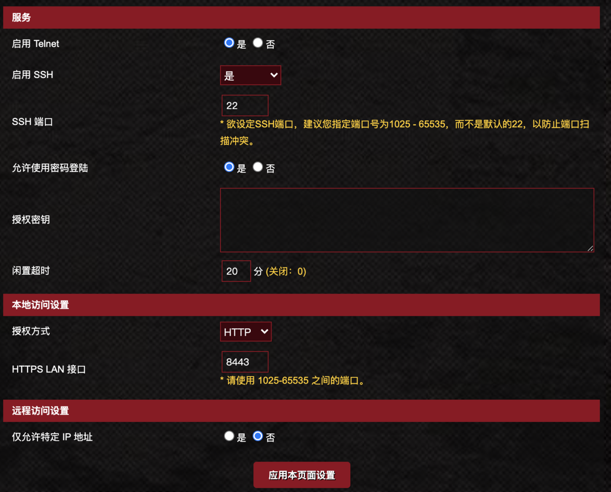
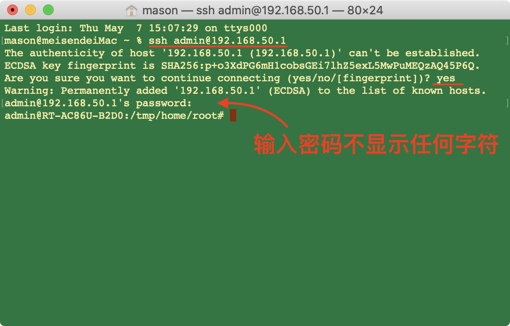
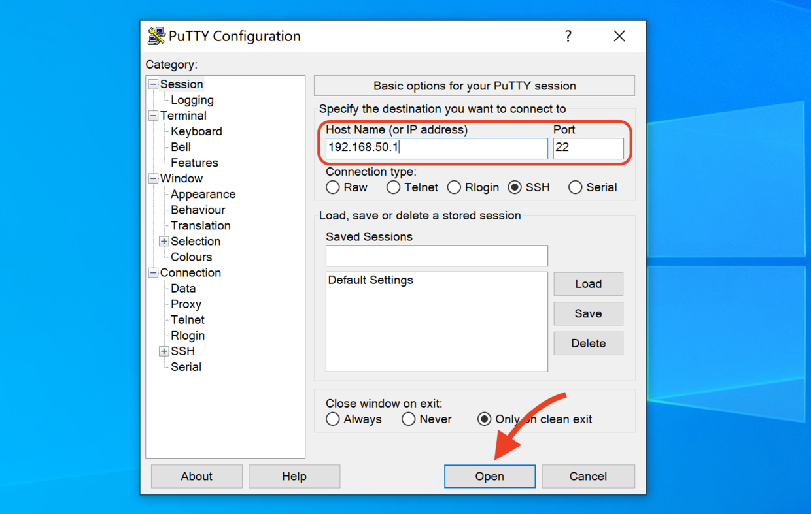
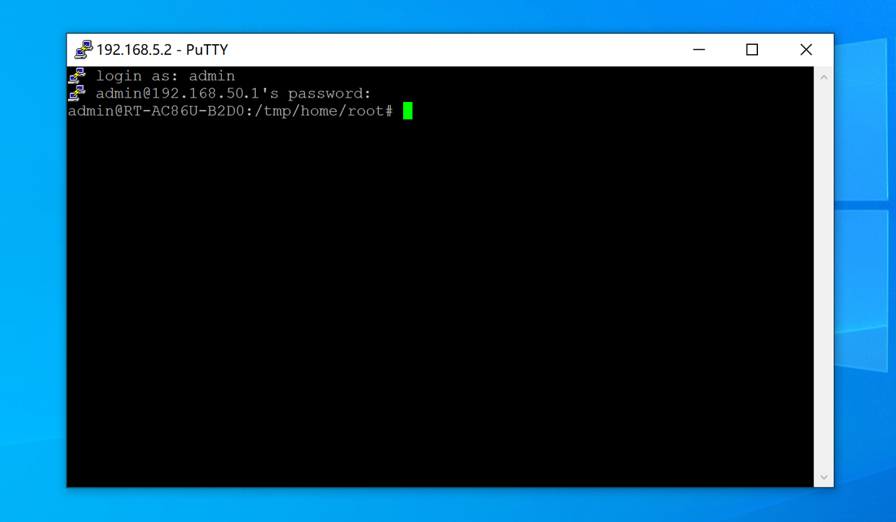

# 路由器软件中心重置/删除方法（解决一直显示正在更新…）

### 步骤一 路由器打开 SSH
「系统管理」>「系统设置」>「服务」启用 SSH，点选“应用本页设置”。




### 步骤二、电脑连接 SSH
**macOS 上操作**
1. 打开终端输入 `ssh root@192.168.50.1` 按回车键。
> 注：`root` 是您路由器的用户名；`@` 后面的数字是您路由器的登录IP。
> 示例：我的路由器登录用户名是 admin，则输入 `ssh admin@192.168.50.1`
2. 输入`yes`，按回车键；再输入路由器登录密码，按回车键。



**Windows 上操作**
1. 安装 [Putty](https://www.chiark.greenend.org.uk/~sgtatham/putty/latest.html) 软件，打开输入 `192.168.50.1`，点击 open；如弹出对话框点击`否`。



2. 输入路由器用户名，按回车键；再输入路由器密码，按回车键。
>示例：我的路由器登录用户名是 admin，则输入`admin`；输入密码不显示任何字符。



### 步骤三、重置软件中心
**🔴官改方法一：一键重置（推荐）**

* 【官改固件】384.45149及其以上版本，在 ssh 客户端运行 `koolshare-reset` 命令。

**🔴官改方法二：命令重置**

1. 关闭软件中心相关进程，删除软件中心文件。在 ssh 客户端依次输入或粘贴以下命令，按回车键。

```
kill -9 $(pidof skipd)
cd /koolshare/perp && sh perp.sh stop
cd / && rm -rf /jffs/.asusrouter /jffs/.koolshare /jffs/db
```
2. 重置软件中心。输入或粘贴以下命令，按回车键。

```
jffsinit.sh
cd /koolshare/perp && sh perp.sh start
service restart_skipd
```
3. 重启路由器。输入或粘贴以下命令，按回车键。

```
reboot
```
* 进入软件中心，将软件中心版本更新到最新，安装插件。

---

**🟢梅林方法一：界面重置（推荐）**

* 在**【系统管理 】–【系统设置】**内勾选：`Format JFFS partition at next boot` 和 `Enable JFFS custom scripts and configs` 然后点击`应用本页面设置`，然后点击顶部`重新启动`按钮重启路由器。此操作可以清除jffs分区中的所有数据，包括安装在jffs分区的软件中心和所有插件。
* 重启路由后，软件中心会自动重新完成初始安装，然后将路由器连上网络，进入软件中心将软件中心更新到最新即完成软件中心重置。

**🟢梅林方法二：命令重置**

* 需要开启固件的ssh功能（【系统管理 】-【 系统设置】-【启用 SSH】），然后使用ssh客户端（Putty、Xshell、SecureCRT等软件均可）登录进路由器后输入命令。

* 用ssh客户端登录进后台后，直接在ssh客户端内运行`koolshare-reset`命令即可。

---

**安装科学上网提示**： 检测到离线安装包名有非法关键词，开启路由器的SSH功能，登录并输入以下命令后，再进行离线安装。

方法：链接 SSH 输入 `sed -i 's/\tdetect_package/\t# detect_package/g' /koolshare/scripts/ks_tar_install.sh` 按回车键。

---
### 以下内容为附加，不需要的不要操作
**释放 jffs 空间**
* 此操作会删除 jffs 分区内的所有文件，包括但不限于：软件中心、安装的证书、自定义的设备图标等。
```
kill -9 $(pidof skipd)
rm -rf /jffs/.asusrouter /jffs/.koolshare /jffs/.sys /jffs/.wtfast /jffs/*
reboot
```

**删除软件中心**
* 适用于`官改`/`梅林`刷回`原厂`，需要删除留在 jffs 分区内软件中心，而不删除其它文件。
* 如果是在`官改`/`梅林`下删除软件中心，重启路由，路由会自动重新安装软件中心。
```
kill -9 $(pidof skipd)
rm -rf /jffs/.asusrouter /jffs/.koolshare /jffs/db /jffs/config/* /jffs/etc/profile
reboot
```
**重启软件中心**
* 当 httpdb 进程挂掉的时候，此时可以用 ssh 进入路由器后台，输入以下命令重启 httpdb：
```
cd /koolshare/perp
sh perp.sh stop
sh perp.sh start
```